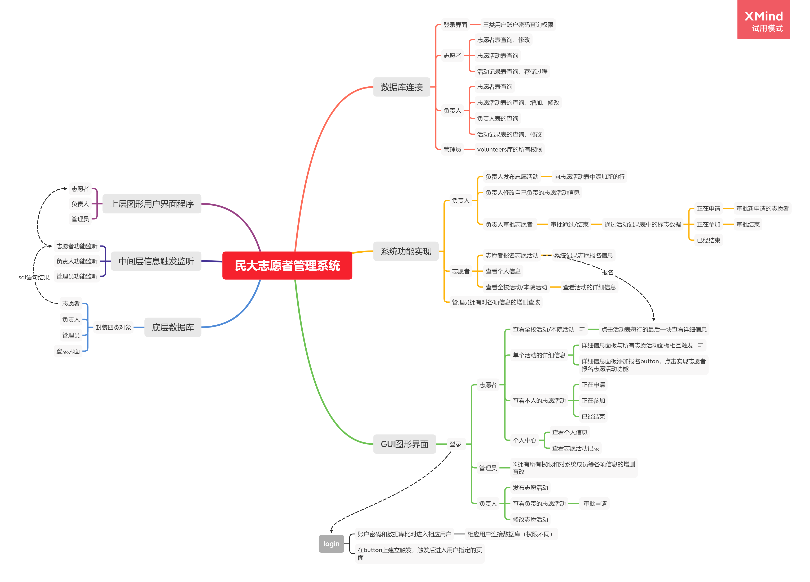

# MUC-Volunteer-management-system

##### how to run or debug?
###### src\window\login.java
```
public static void main(String args[]) throws SQLException, ClassNotFoundException {
    	//登录界面输入账户和密码
        login lg = new login();
        //连接数据库与数据库内已有账户密码比对，根据身份进入不同界面
        ld = new login_db();
        lg.loginButton.addActionListener(new ActionListener() {
            @Override
            public void actionPerformed(ActionEvent e) {
            ....
            ....
```
---
- src文件夹为项目完整代码，
- 其中connect_database封装了用户和底层数据库的连接操作和SQL语句	
- Listener为中间层信息触发监听代码
- window为上层图形用户界面代码
- mysql数据库需要自行创建(具体见detail.pdf中数据库建立章节),并更改程序中相应代码

